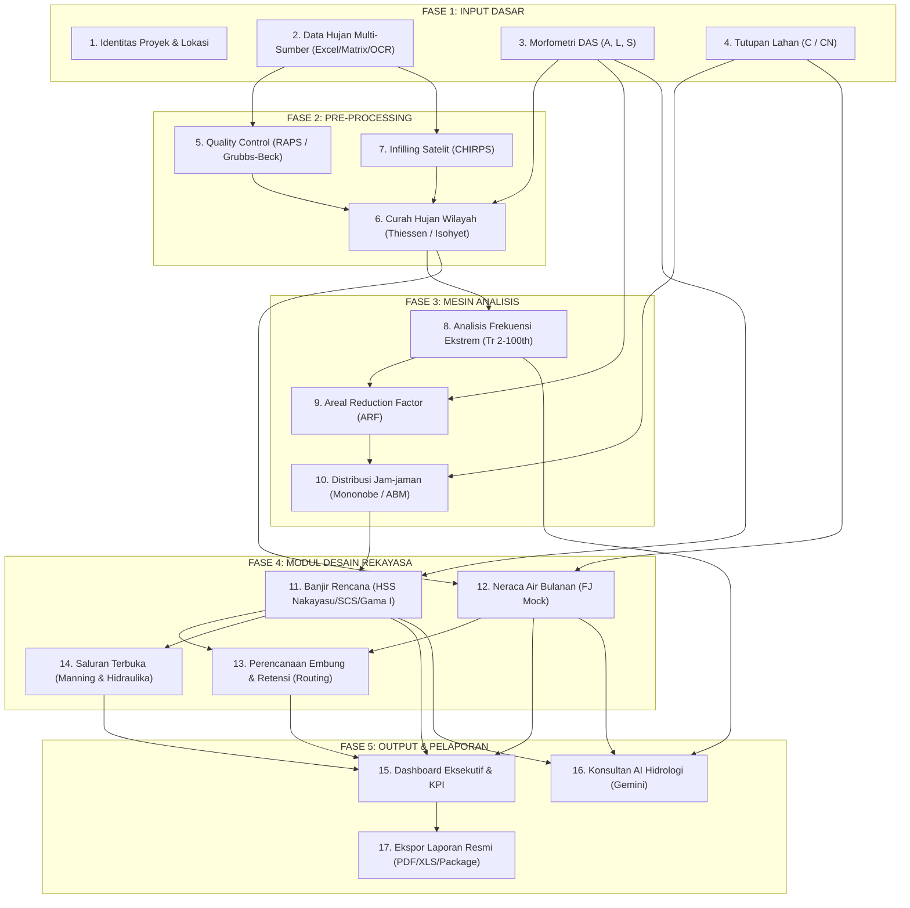
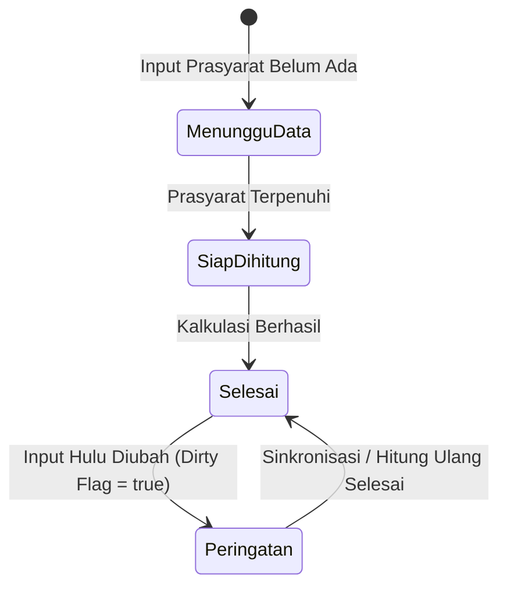

# AUDIT DAN DEFINISI WORKFLOW APLIKASI REKASDA PRO
**Standar Rekayasa:** SNI 2415:2016 · SNI 19-6728.1-2002 · Pd T-02-2004-A · Ditjen SDA Kementerian PU  
**Versi Dokumen:** 1.0 (Audit & Definisi Menyeluruh)  
**Tanggal:** 2026-10-03  

---

## 1. Eksekutif & Prinsip Desain Workflow

Rekasda Pro dirancang sebagai platform rekayasa sumber daya air (*Water Resources Engineering Platform*) kelas produksi yang mengintegrasikan seluruh tahapan pemodelan hidrologi dan hidraulika secara satu kesatuan data (*Single Source of Truth*).

### Prinsip Utama Tata Kelola Data & Alur Kerja:
1. **Unidirectional Strict Data Flow (Alur Searah)**:
   $$\text{Data Master (DAS \& Hujan)} \longrightarrow \text{Pre-Processing / QC} \longrightarrow \text{Mesin Analisis Frekuensi} \longrightarrow \text{Modul Desain (Banjir, Neraca, Embung, Saluran)} \longrightarrow \text{Pelaporan \& Tata Kelola}$$
2. **Cascade Reactive Invalidation**:
   Setiap perubahan pada parameter fundamental hulu secara otomatis menandai status *dirty* (`isFrekuensiDirty`, `isBanjirDirty`, `isNeracaDirty`) pada modul hilir untuk mencegah penggunaan output yang kedaluwarsa.
3. **Standar Nasional Indonesia (SNI First)**:
   Setiap batasan metode diverifikasi sebelum perhitungan dapat diselesaikan:
   * Metode Rasional: Terbatas untuk DAS $\le 300\text{ ha}$ ($3\text{ km}^2$) per SNI 2415:2016.
   * Deret Data Hujan: Wajib $n \ge 10\text{ tahun}$ untuk analisis frekuensi ekstrem.
   * HSS Nakayasu: Parameter default $\alpha = 2.0$ kecuali terkalibrasi data AWLR.
   * Neraca Air: Metode F.J. Mock berbasis kesetimbangan lengas tanah bulanan.

---

## 2. Peta Arsitektur 5 Fase & 17 Modul

---

## 3. Spesifikasi Rinci 17 Modul & Kontrak Data

| No | Modul | Fase | Target Rute / Subtab | Input Kunci | Output Kunci | SNI / Acuan Teknis |
|---|---|---|---|---|---|---|
| **1** | **Identitas Proyek** | Input | `/master?tab=identitas` | Nama pekerjaan, instansi, koordinat lat/lng | `identitasLokasi` | Pedoman Survei SDA |
| **2** | **Data Curah Hujan** | Input | `/master?tab=data-hujan` | File Excel/CSV, Matrix harian, OCR scan | `stasiunList`, `dataHujan` | SNI 2415:2016 |
| **3** | **Morfometri DAS** | Input | `/master?tab=parameter-spasial` | Luas $A$ (km²), Panjang $L$ (km), Kemiringan $S$ | `morfometriDAS` | SNI 2415:2016 |
| **4** | **Tutupan Lahan** | Input | `/master?tab=parameter-spasial` | Poligon guna lahan, nilai $C$, Curve Number | `tutupanLahan`, $C_{gabungan}$ | SNI 2415:2016 |
| **5** | **Quality Control** | Pre | `/master?tab=data-hujan` | Deret data hujan harian/tahunan | `qcResults`, Status Validasi | Grubbs-Beck & RAPS |
| **6** | **Hujan Wilayah (CHw)** | Pre | `/master?tab=parameter-spasial` | Koordinat stasiun, bobot Thiessen/Isohyet | `hasilThiessen`, `arealRainfall` | SNI 2415:2016 |
| **7** | **Infilling Satelit** | Pre | `/master?tab=data-hujan` | Koordinat DAS, data rumpang | `dataHujanInfilled` | WMO No. 168 / CHIRPS |
| **8** | **Analisis Frekuensi** | Engine | `/frekuensi` | Deret Maksimum Tahunan (AMS, $n \ge 10$) | Distribusi terpilih, $R_{24}$ | SNI 2415:2016 |
| **9** | **ARF Wilayah** | Engine | `/frekuensi` | Hujan rencana titik, luas DAS ($A$) | `hasilARF` ($R_{24,DAS}$) | SNI 2415:2016 |
| **10** | **Distribusi Jam-jaman** | Engine | `/banjir` | $R_{24}$, koefisien $C$, durasi $T_d$ (jam) | `distribusiHujan`, `hujanEfektif` | Mononobe / ABM |
| **11** | **Banjir Rencana** | Modul | `/banjir` | Hujan efektif, hidrograf satuan sintetik | $Q_p$ (m³/s), Hidrograf banjir | SNI 2415:2016 |
| **12** | **Neraca Air** | Modul | `/neraca` | Hujan bulanan, $ETo$, parameter tanah | Ketersediaan air, $Q_{80\%}$, Surplus | SNI 19-6728.1-2002 |
| **13** | **Perencanaan Embung** | Modul | `/embung` | Hidrograf inflow $Q_p$, kurva elevasi-volume | Volume tampung, penelusuran banjir | Pd T-02-2004-A |
| **14** | **Kapasitas Saluran** | Modul | `/saluran` | Debit rencana $Q$, kemiringan $S$, kekasaran $n$ | Dimensi $b, h, H$, Froude, Jagaan | Pd T-02-2004-A / Manning |
| **15** | **Dashboard Eksekutif** | Output | `/exec` | Agregasi KPI dari seluruh modul aktif | Rekapitulasi teknis eksekutif | Standar SDA |
| **16** | **Konsultan AI** | Output | `/ai` (atau Drawer global) | State kalkulasi aktif & parameter desain | Rekomendasi teknis & verifikasi SNI | LLM + Heuristik SNI |
| **17** | **Ekspor Laporan** | Output | `/exec` | Hasil pemodelan & grafik hidrologi | PDF A4 resmi, Excel, `.rekasda` | Format Konsultansi |

---

## 4. Matriks Status & State Transition Rules

Setiap modul dievaluasi secara dinamis oleh `workflowStatusEngine` berdasarkan kondisi *readiness* dan *dirty flag*:

### Aturan Transisi Status (*State Rules*):
1. **Menunggu Data (`pending`)**: Belum memenuhi parameter prasyarat wajib (misal: analisis frekuensi belum memiliki deret data hujan $\ge 10\text{ tahun}$).
2. **Siap Dihitung / Siap Disimulasi (`ready`)**: Prasyarat terpenuhi, modul siap dieksekusi dengan 1-klik tombol hitung.
3. **Selesai (`success`)**: Perhitungan telah selesai dan tersimpan di store global dengan status data valid dan mutakhir.
4. **Peringatan (`warning`)**: Modul sebelumnya telah dihitung, namun salah satu parameter masukan di hulu mengalami mutasi (misal: luas DAS diubah atau data hujan diedit), sehingga hasil kalkulasi modul saat ini berstatus kedaluwarsa (*stale*).

---

## 5. Hasil Audit & Perbaikan yang Diterapkan

Dalam audit mendalam terhadap basis kode yang ada, ditemukan dan telah diperbaiki beberapa ketidaksesuaian kritis:

### Temuan 1: Target Rute Poligon Thiessen
* **Sebelumnya**: `targetTab` untuk modul Thiessen di engine alur kerja mengarah ke `/frekuensi`. Pengguna yang mengklik "Buka Modul" dari *Workflow Canvas* dibawa ke halaman analisis frekuensi, padahal perhitungan poligon bobot Thiessen berada di tab Parameter Spasial.
* **Perbaikan**: Diperbarui menjadi `/master?tab=parameter-spasial`, sehingga tombol navigasi langsung membuka kartu Poligon Thiessen secara presisi.

### Temuan 2: Sinkronisasi Status Dirty ke Engine Workflow
* **Sebelumnya**: Engine status workflow (`workflowStatusEngine.ts`) hanya memeriksa keberadaan objek hasil (`hasFloodResult`, `hasFrekuensi`, dll). Jika parameter diubah, kartu di *Workflow Canvas* tetap berstatus "Selesai" (hijau).
* **Perbaikan**: Diintegrasikan status `isFrekuensiDirty`, `isBanjirDirty`, dan `isNeracaDirty`. Modul yang terpengaruh kini otomatis berubah status menjadi **"Peringatan"** (kuning) dengan keterangan jelas (misal: *"Parameter hulu berubah — Hidrograf banjir perlu dihitung ulang"*).

### Temuan 3: Step Banjir pada Onboarding Checklist
* **Sebelumnya**: Komponen onboarding (`GettingStartedChecklist.tsx`) tidak menandai langkah ke-4 ("Hitung Banjir Rencana") sebagai selesai saat pengguna menyelesaikan simulasi di `ModulBanjirRencana.tsx` (karena modul baru belum memanggil `completeStep('banjir')`).
* **Perbaikan**: Dipasang `useOnboarding()` di `ModulBanjirRencana.tsx` yang memanggil `completeStep('banjir')` tepat setelah hasil hidrograf disimpan.

### Temuan 4: Penyempurnaan Tahapan Onboarding
* **Sebelumnya**: Checklist onboarding hanya mencakup 4 langkah (`identitas` $\to$ `hujan` $\to$ `frekuensi` $\to$ `banjir`), melewatkan tahap krusial input Morfometri DAS ($A$ dan $L$). Akibatnya pengguna yang mengikuti checklist onboarding menemukan tombol hitung banjir terkunci ("Lengkapi Data Spasial").
* **Perbaikan**: Ditambahkan langkah **"Morfometri DAS (A & L)"** ke dalam `GettingStartedChecklist.tsx` dengan rute `/master?tab=parameter-spasial` dan hook otomatis saat morfometri disimpan di `KarakteristikDASCard.tsx`.

---

## 6. Verifikasi & Integritas Pengujian

* **Unit Tests Workflow Status Engine**: 6/6 pengujian passing di `workflowStatusEngine.test.ts`.
* **Cascade Invalidation Tests**: 5/5 pengujian passing di `cascadeInvalidation.test.ts`.
* **Total Keseluruhan Pengujian**: 225 passing di 26 file pengujian (`0 failed`).
* **TypeScript Check**: `tsc --noEmit` lulus bersih tanpa kesalahan tipe.
* **Production Build**: Kompilasi Vite dan PWA service worker sukses.
