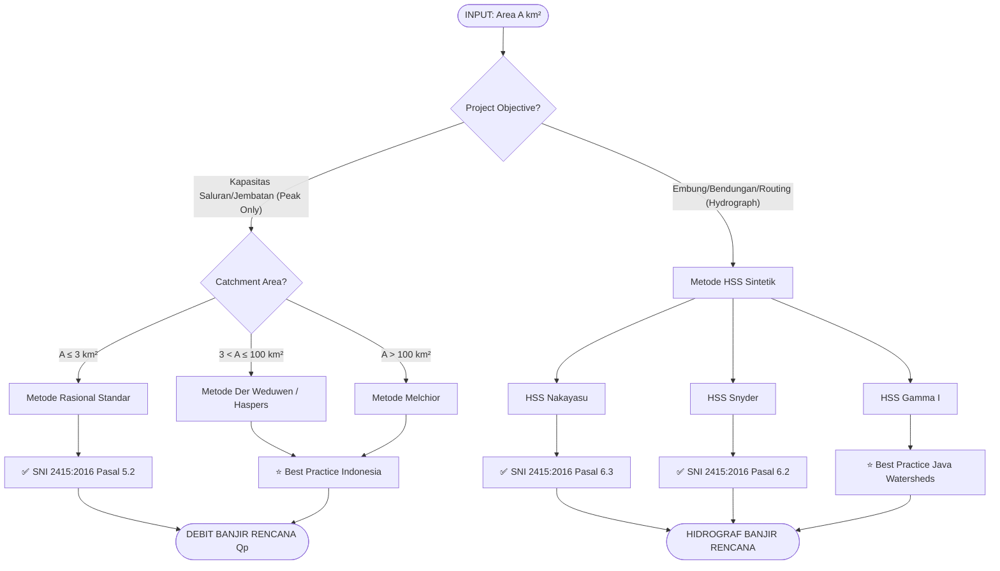
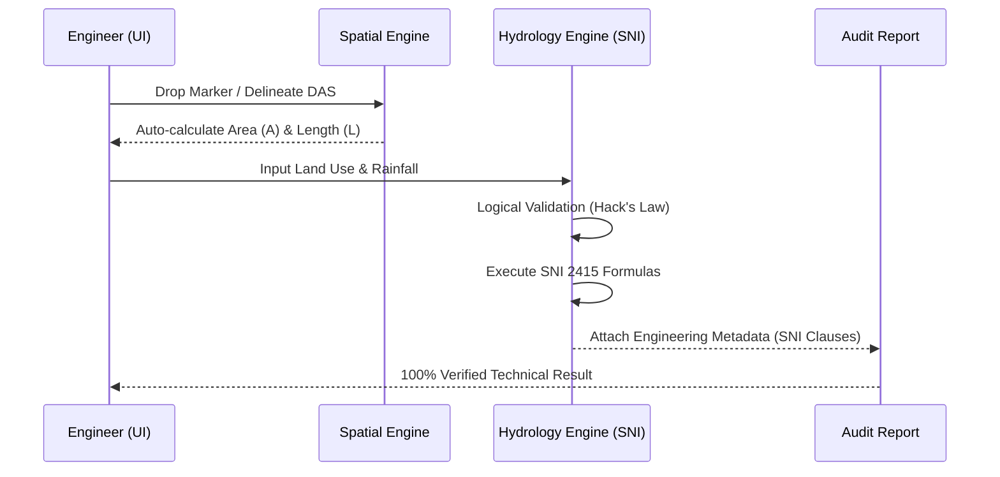

# Professional Engineering Workflow - SNI 2415:2016

This diagram represents the expert decision logic implemented in RekaSDA v1.1, combining SNI 2415:2016 standards with Indonesian professional engineering heuristics (PUPR/Sosrodarsono).

## 1. Master Decision Tree



## 2. Technical Validation Logic (Zero-Hallucination Guard)

The system enforces logical continuity between spatial inputs and mathematical outputs.

### A. Geometri DAS Audit (Hack's Law)
Before calculation, the system verifies the physical realism of the watershed:
*   **Formula**: $L \approx 1.4 \times A^{0.6}$
*   **Deviation Guard**: If $L$ deviates $> 200\%$ or $< 50\%$ from the empirical mean, a **Spatially Inconsistent** warning is flagged.

### B. SNI Method Enforcement
| Condition | Constraint | System Action |
| :--- | :--- | :--- |
| **Rational Method** | Area $A > 3$ km² | **FLAG WARNING**: "Non-compliant with SNI 2415:2016 Pasal 5.2" |
| **Nakayasu** | Parameter $\alpha$ | **EXPOSE CALIBRATION**: Default 2.0, Range [1.5, 3.0] |
| **Rainfall Intensity** | Missing $I$ | **AUTO-FALLBACK**: Mononobe Transformation via $R_{24}$ & $t_c$ |

## 3. Data Integration Flow



## 4. Engineering Metadata Schema
Every result exported by the system includes an audit trail:
```json
{
  "value": 15.42,
  "unit": "m3/s",
  "metadata": {
    "standard": "SNI 2415:2016",
    "clause": "Pasal 6.3",
    "method": "HSS Nakayasu",
    "logic_checks": ["Hack's Law: Valid", "Area Limits: OK"],
    "notes": "Alpha=2.0, Tg calculated via L=15km"
  }
}
```

---
**Standard Implementation**: `src/utils/engineeringDecisionTree.ts`  
**Reference**: SNI 2415:2016, Sosrodarsono (1993)
